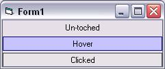

<div align="center">

## Cool Hover Button 1\.5


</div>

### Description

Makes a cool button like what you see on MSDN or Microsoft's ASP.NET Web Matrix.

UPDATED TO VERSION 1.5. FIXES:

- Fixed when label is clicked, click event works.

- Added "Option Explicit".

- Fixed enabling/disabling of button.
 
### More Info
 
If there is any problems please let me know. :)


<span>             |<span>
---                |---
**Submitted On**   |2003-03-22 01:06:42
**By**             |[Kevin Kanowitz](https://github.com/Planet-Source-Code/PSCIndex/blob/master/ByAuthor/kevin-kanowitz.md)
**Level**          |Advanced
**User Rating**    |3.3 (10 globes from 3 users)
**Compatibility**  |VB 6\.0
**Category**       |[Custom Controls/ Forms/  Menus](https://github.com/Planet-Source-Code/PSCIndex/blob/master/ByCategory/custom-controls-forms-menus__1-4.md)
**World**          |[Visual Basic](https://github.com/Planet-Source-Code/PSCIndex/blob/master/ByWorld/visual-basic.md)
**Archive File**   |[Cool\_Hover1562893222003\.zip](https://github.com/Planet-Source-Code/kevin-kanowitz-cool-hover-button-1-5__1-44176/archive/master.zip)

### API Declarations

```
Private Declare Function GetCursorPos Lib "user32" (lpPoint As POINT_API) As Long
Private Declare Function ScreenToClient Lib "user32" (ByVal hWnd As Long, lpPoint As POINT_API) As Long
Private Type POINT_API
 X As Long
 Y As Long
End Type
```


